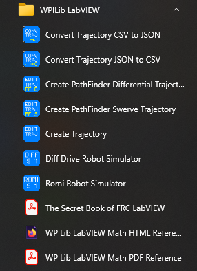
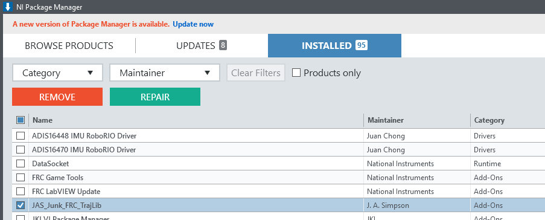
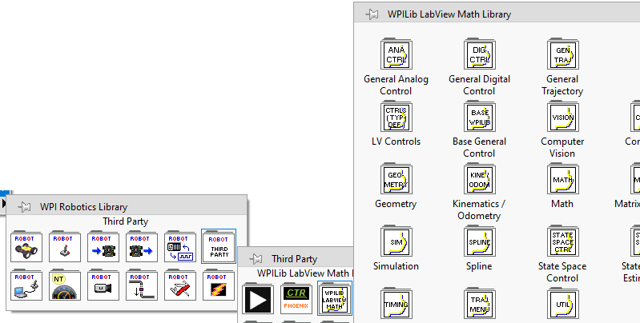
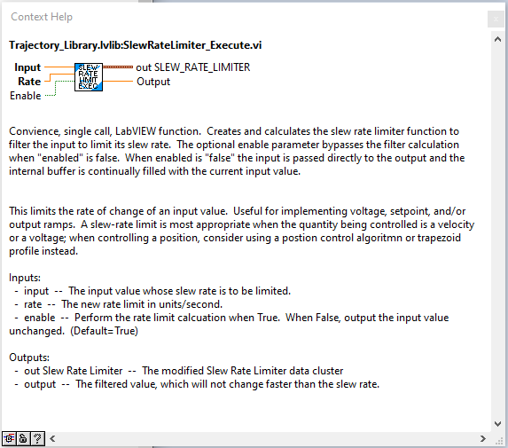

# FRC Control and Trajectory Library

This library is an UNOFFICIAL port of the Java/C++ WPILIB routines that don't already exist in LabVIEW.  The library is used for the First FRC robotics competition.

Originally this library was only a port of the Trajectory creation and execution routines.  However, over time, most of the other "math" routines have also been ported.  As of version 2.x it also contains a majority of the State Space control and simulation routines found in the C++/Java WPILIB.

A number of trajectory creation and transformation utility
programs are installed along with the library.  These programs may be of use to FRC teams that use languages other than LabVIEW.

  

This repository contains the library and a LabVIEW project used to build the library install package.  There is an accompanying repository containing samples, 
the source of the utility programs, and a number of test programs.  This repository 
can be found here: https://github.com/jsimpso81/FRC_LV_TrajLib_Util_and_Samp

---
## Installs

### Installation

There are a number of prerequisites needed before installing this library.
1. Install the FRC version of LabVIEW.  (If only the utility programs are desired, LabVIEW may not need to be installed.  However this has **NOT** been tested.)
1. Install the FRC game tools

Download the latest install package.  These can be found in the **Releases** section of the github repository.  Here is a direct link.  https://github.com/jsimpso81/FRC_LV_TrajLib/releases/latest

Select the *.nipkg* installation file, then double click it, or right click and select install.  Administrative privledges will be needed to perform this installation.  Follow the instructions.  Usually selection of all the default answers is sufficient.  Installation should take 5 minutes or less.

Previous versions do not have to be uninstalled prior to installing a new version.  The new version will automatically upgrade the older version.

### Removal

To uninstall, open NI Package Manager.  Select the *Installed* tab.  Find and highlight  **JAS_Junk_FRC_TrajLib**.  Then click the *REMOVE* button.  The uninstall should start. It should take 5 minutes or less.

---
## Library Summary

The library includes a large collection of subVIs that can be used in robot programs.

### Function Summary

Here is a short list of the types of functions included in the library

|                                                              |                                                              |
|--------------------------------------------------------------|--------------------------------------------------------------|
|- Control Functions / Math Functions                          |- Model (State Space)                                         |
|  - Angle Modulus                                             |  - DC Motor                                                  |
|  - Apply Deadband                                            |  - Linear System ID                                          |
|  - Clamp                                                     |- Simulation (Physical system, not actuator and sensor)       |
|  - Get Modulus Error                                         |  - Battery Simulation                                        |
|  - Function Generator                                        |  - Differential Drive Train Simulation                       |
|  - Input Modulus                                             |  - Elevator Simulation                                       |
|  - Interpolate                                               |  - Flywheel Simulation                                       |
|  - *Slew* Rate Limiter                                       |  - Linear System Simulation                                  |
|- Filters (Classical)                                         |  - Single Joint Arm Simulation                               |
|  - Linear Filter (including 1st, 2nd order low/high pass)    |- Geometry                                                    |
|  - Median Filter                                             |  - Pose                                                      |
|  - Moving Average Filter                                     |  - Rotation                                                  |
|- Filters / Estimators (State Space)                          |  - Transform                                                 |
|  - Differential Drive Pose Estimator (Similar to Odometry)   |  - Translation                                               |
|  - Kalman Filter                                             |  - Twist                                                     |
|  - Kalman Filter Latency Compensator                         |- Kinematics / Odometry                                       |
|  - Swerve Drive Pose Estimator                               |  - Chassis Speeds                                            |
|  - Unscented Kalman Filter                                   |  - Differential drive (tank/arcade)                          |
|- Controllers (Classical)                                     |  - Mecanum drive                                             |
|  - Arm Feedforward                                           |  - Swerve drive                                              |
|  - Bang Bang                                                 |- Spline / Trajectory                                         |
|  - Elevator Feedforward                                      |  - Cubic, Quintic Splines                                    |
|  - Holonomic Drive                                           |  - Configure, with constraints                               |
|  - PID / Advanced PID                                        |  - Generate                                                  |
|  - Profiled PID                                              |  - Sample (forward and reverse)                              |
|  - Ramsete                                                   |- Pathfinder Utilities                                        |
|  - Simple Motor Feedforward                                  |  - Convert to trajectory                                     |
|- Controllers (State Space)                                   |- Computer Vision Utilities                                   |
|  - Implicit Model Follower                                   |- Units Conversion                                            |
|  - Linear Plant Inversion Feedforward                        |- Math Utilities                                              |
|  - Linear Quadratic Regulator                                |  - Angle Statistics                                          |
|  - Linear System                                             |  - Merwe Scaled Sigma Points                                 |
|  - Linear System Loop                                        |  - Numerical Integration                                     |
|- Timer                                                       |  - Numerical Jacobian                                        |
|  - Timer functions                                           |  - Ricatti Equation                                          |
|- Digital Logic                                               |- Matrix Utilities                                            |
|  - Debounce                                                  |- State Space Utilities                                       |
|  - Off Delay                                                 |- Utilities                                                   |
|  - On Delay                                                  |  - Read FPGA time (with rollover protection)                 |
|  - One Shot                                                  |  - Library use and version information                       |
|  - Set Reset Flip Flop                                       |  - Read trajectory CSV file                                  |
|                                                              |  - Write and document trajectory CSV file                    |
|--------------------------------------------------------------|--------------------------------------------------------------|

### Menus
 
Menu items for all the subVI's are included as part of the standard LabVIEW WPI Robotics Library menu

### Help

Each VI includes help that can be accessed using the standard LabVIEW help toggle (Ctrl H).

---
## Trajectory Creation

Robot trajectories can be created a number of different ways.  The following chart shows some (maybe most) of the different ways of creating a trajectory for robot execution.

---
## Utility Program Summary

The installed library contains a number of utility programs.

- **Create Trajectory Using Trajectory Library**

	Create a trajectory using the trajectory library routines and write it to a CSV (comma separated value) file that can be
	copied to a RoboRIO and read by the robot code.  The trajectory is created by:

	1. Defining robot properties
	1. Defining drive system constraints
	1. Defining the trajectory "waypoints".
	1. Creating and reviewing the trajectory.  If changes need to be made to back to steps *i*,*ii*,*iii* as needed.
	1. Write the trajectory to a file. (CSV or JSON)
	1. Optionally write trajectory definition configuration.  (Allows future modification without redefining entire trajectory information.)

    Sample screen shot

    

    

    Sample trajectory file

    

- **Create_Trajectory_Using_PathfinderDifferential**

	Create a trajectory using Jaci Brunning's Pathfinder library for a robot using a "differential drive" and write it to a 
	CSV (comma separated value) file that can be
	copied to a RoboRIO and read by the robot code.

	More information on Pathfinder can be found here https://github.com/JaciBrunning/Pathfinder  
	One of the biggest differences between this Trajectory Library and Pathfinder is that Pathfinder uses S curves instead of
	trapezoids.

	Sample trajectory file

	

- **Create_Trajectory_Using_PathfinderSwerve**

	Create a trajectory using Jaci Brunning's Pathfinder library for a robot using a "swerve drive" and write it to a 
	CSV (comma separated value) file that can be
	copied to a RoboRIO and read by the robot code.    

	More information on Pathfinder can be found here https://github.com/JaciBrunning/Pathfinder  
	One of the biggest differences between this Trajectory Library and Pathfinder is that Pathfinder uses S curves instead of
	trapezoids.

- **Convert PathWeaver JSON File To Trajectory File**

	Read a JSON file created by the PathWeaver utility.  Write this trajectory as a CSV file for use with this library.

---
## Special Notes

Library routines in the library virtual directory *NEW_THINGS_USE_WITH_CAUTION*, which includes are the version 2 routines, are a work in progress. These have not been thoroughly tested.  They have not been documented yet, however the FRC WPILIB C++/Java documentation should be able to be used.  There are also some test and sample programs in the samples repository.

---
## Reporting Issues

Use the github issues menu to submit information on issues and suggested enhancements.  
I'll attempt to deal with issues in a reasonable time, but there are no guarantees.

When submitting an issue, please follow these guidelines:
- Make certain you are using the latest version of the library.  If not, install the latest version and see if the issue still occurs.
- See if the issue has already been reported.  If so, add any new details to the existing issue.
- Write a very detailed specific description of the problem.
- Include any screen shots or other data needed to show the issue.
- Describe exactly how to reproduce the error.  (Likely, I can't try this on your robot...)
- If possible, try and condense the problem to a small test program that isolates the issue.
- If you found a work around, please include it for others to use.
See  for additional details.

---
## Contributing

Contributions of enhancements, bug fixes, and new routines are welcome.  If new routines are not already part of the C++/Java WPILIB, then it seems fair that they 
should be written solely by FRC student members, with confirmation from a mentor on their team to be able to be candidates for inclusion.  
See  for additional details.

---
File last updated: 5/02/2022
